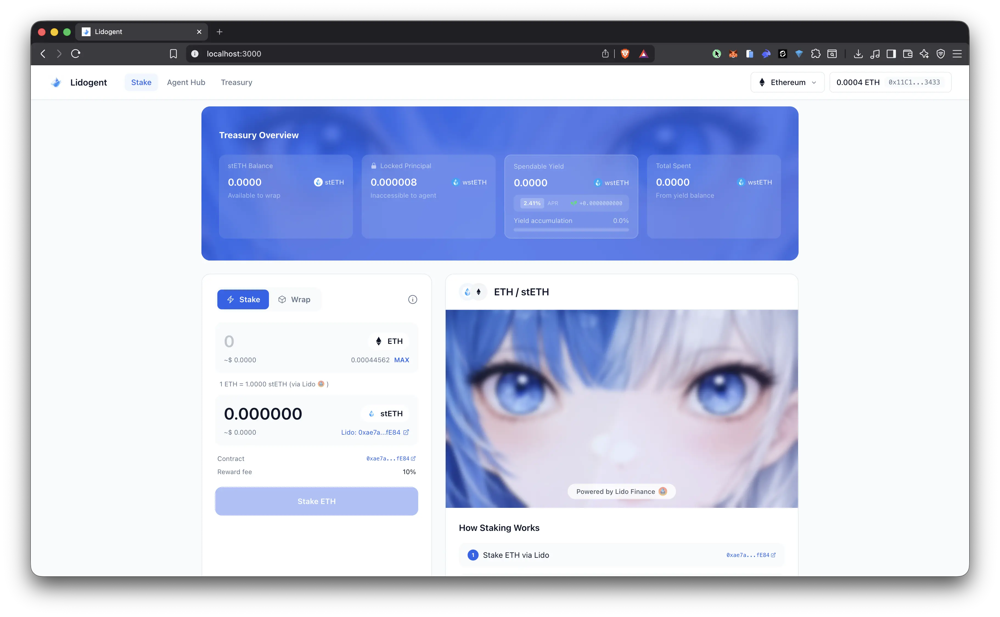
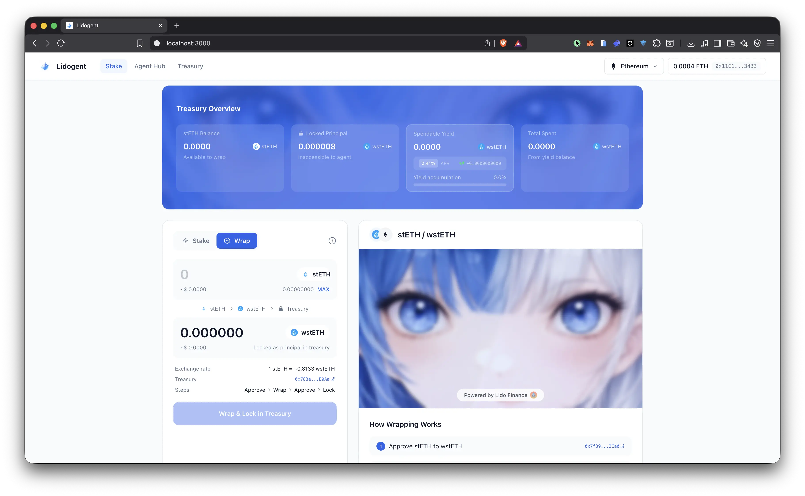
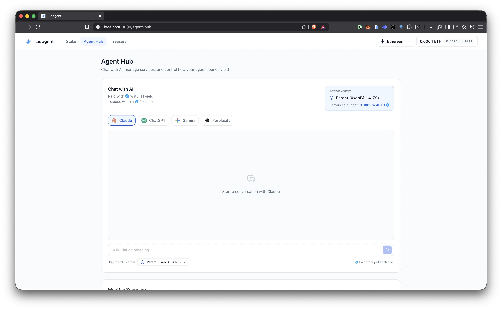
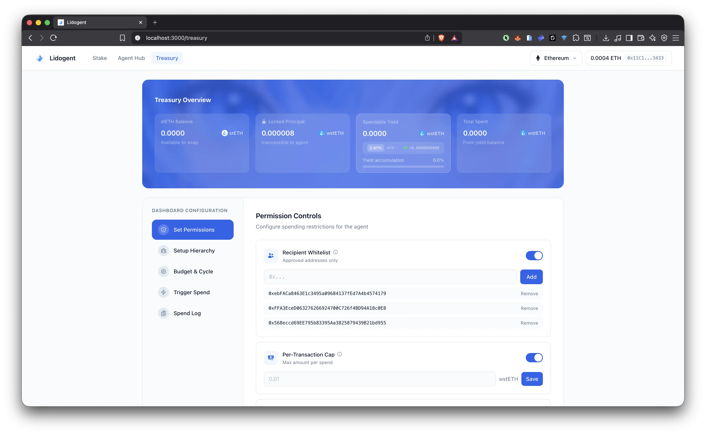
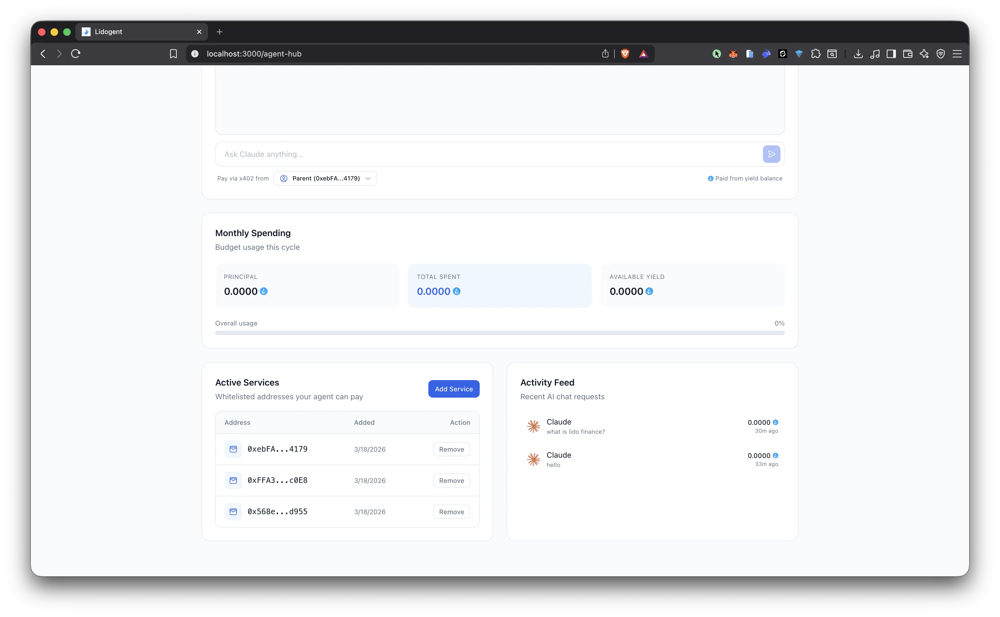
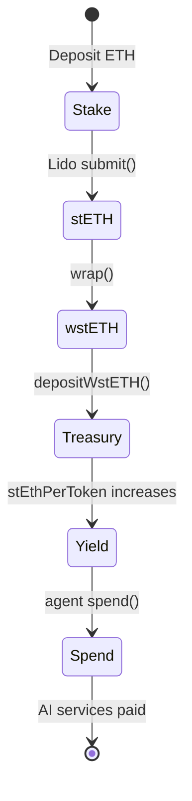

<div align="center">
  

# Lidogent

**Yield-bearing operating budget for AI agents, powered by Lido stETH.**
**Humans deposit, principal stays locked, agents spend only from yield.**

[](https://lidogent.vercel.app)
[](https://etherscan.io)
[](https://lido.fi)
[](https://data.chain.link)
[](./LICENSE)

</div>

---

## What is Lidogent?

AI agents need operating budgets to pay for API calls, compute, and services. But giving an agent direct access to funds is risky — one bug or exploit and the treasury is drained.

**Lidogent** solves this by using Lido stETH staking yield as the agent's budget source. Humans deposit ETH, which gets staked via Lido and wrapped to wstETH. The principal is **structurally locked** in the smart contract — no function exists for the agent to access it. Only the **yield** (staking rewards, ~2.4% APR) flows into the agent's spendable balance.

All spending is enforced onchain: recipient whitelists, per-transaction caps, cycle rate limits, and per-agent budgets.

---

## Problem

| Problem | Description |
|---------|-------------|
| **No Safe Funding** | Giving agents direct access to funds means one exploit drains everything |
| **No Yield Utilization** | Staked ETH earns rewards, but agents can't use that yield autonomously |
| **No Onchain Permissions** | Existing solutions rely on off-chain trust, not contract-level enforcement |

## Solution

| Solution | How |
|----------|-----|
| **Principal Locked** | wstETH deposited as principal — structurally inaccessible to agent |
| **Yield-Only Spending** | Agent budget comes from staking rewards via Lido (~2.4% APR) |
| **Onchain Permissions** | Whitelist, per-tx cap, cycle rate limit — all enforced at contract level |

---

## Screenshots

### Stake ETH via Lido
Deposit ETH to receive stETH through Lido's staking contract. Real-time ETH price from Chainlink, balance from wallet, and exchange rate displayed. One-click staking with transaction confirmation popup.

<div align="center">
  
</div>

### Wrap stETH & Lock in Treasury
Wrap stETH to wstETH and lock as principal in AgentTreasury. 4-step stepper popup guides the process: approve stETH, wrap via Lido, approve wstETH, lock in treasury. All enforced onchain.

<div align="center">
  
</div>

### AI Chat — Pay Per Request
Chat with AI models (Claude, ChatGPT, Gemini, Perplexity) powered by OpenRouter. Each request is paid from the agent's wstETH yield balance via x402. Select which agent pays from the dropdown.

<div align="center">
  
</div>

### Treasury Dashboard Configuration
Configure agent permissions, hierarchy, budget cycles, and spending controls. All settings read from and write to the deployed AgentTreasury contract on Ethereum Mainnet.

<div align="center">
  
</div>

### Activity Feed
Track all AI chat requests and agent spending in real-time. Shows model used, message preview, cost in wstETH, and timestamp. Data persisted to localStorage.

<div align="center">
  
</div>

---

## Key Features

| Feature | Description |
|---------|-------------|
| Fully Onchain | All deposits, permissions, and spending recorded on Ethereum Mainnet |
| Lido Integration | Real stETH/wstETH staking via Lido — no mocks |
| Multi-Agent | Parent agent + sub-agents with individual budget caps |
| AI Chat | Pay per request via x402 (Claude, ChatGPT, Gemini, Perplexity) |
| Live Data | ETH price from Chainlink, APR from Lido API, balances from ERC20 |
| Permission Controls | Whitelist toggle, per-tx cap, cycle rate limit — owner configurable |

---

## System Architecture

```
Human deposits ETH
       |
       v
  Lido (0xae7a...)
  submit() → receives stETH
       |
       v
  wstETH (0x7f39...)
  wrap() → non-rebasing token
       |
       v
  AgentTreasury (0x783e...)
  principal locked, yield accrues
       |
       v
  Agent spends yield
  → AI services (Claude, ChatGPT, Gemini, Perplexity)
  → Only to whitelisted addresses
  → Within per-tx caps and cycle limits
  → Principal never touched
```

---

## Lido Finance Architecture Integration

The Lidogent protocol integrates directly with Lido Finance contracts on Ethereum Mainnet. Here are the core files composing this integration:

| Component Level | File Name | Description |
|-----------------|-----------|-------------|
| **Smart Contract** | [`contracts/src/AgentTreasury.sol`](./contracts/src/AgentTreasury.sol) | Main treasury contract. Calls Lido `submit()` for ETH staking, `wstETH.wrap()` for wrapping, and tracks yield via `getStETHByWstETH()`. |
| **Smart Contract** | [`contracts/src/interfaces/IWstETH.sol`](./contracts/src/interfaces/IWstETH.sol) | Interface for Lido wstETH contract — `wrap()`, `unwrap()`, `getStETHByWstETH()`, `stEthPerToken()`. |
| **Smart Contract** | [`contracts/src/interfaces/ILido.sol`](./contracts/src/interfaces/ILido.sol) | Interface for Lido stETH contract — `submit()` to stake ETH and receive stETH. |
| **Smart Contract** | [`contracts/script/Deploy.s.sol`](./contracts/script/Deploy.s.sol) | Deployment script targeting Ethereum Mainnet with real Lido contract addresses. |
| **Smart Contract** | [`contracts/test/AgentTreasury.t.sol`](./contracts/test/AgentTreasury.t.sol) | 30 fork tests against real Lido stETH and wstETH on Ethereum Mainnet. |
| **Frontend** | [`frontend/src/config/contracts.ts`](./frontend/src/config/contracts.ts) | ABI definitions for AgentTreasury, wstETH (`wrap`, `stEthPerToken`), and ERC20 (`approve`, `balanceOf`). |
| **Frontend** | [`frontend/src/hooks/use-treasury.ts`](./frontend/src/hooks/use-treasury.ts) | Wagmi hooks for all AgentTreasury interactions — deposits, spend, permissions, sub-agents. Includes `useStETHBalance()` reading Lido stETH ERC20. |
| **Frontend** | [`frontend/src/hooks/use-lido.ts`](./frontend/src/hooks/use-lido.ts) | Hooks reading Lido wstETH contract — `useStEthPerToken()`, `useWstETHConversion()`, `useStETHToWstETH()`. |
| **Frontend** | [`frontend/src/hooks/use-lido-apr.ts`](./frontend/src/hooks/use-lido-apr.ts) | Fetches real-time stETH APR from Lido API (`eth-api.lido.fi/v1/protocol/steth/apr/last`). |
| **Frontend** | [`frontend/src/hooks/use-eth-price.ts`](./frontend/src/hooks/use-eth-price.ts) | Reads ETH/USD price from Chainlink Price Feed onchain for USD conversion display. |
| **Frontend** | [`frontend/src/app/api/lido-apr/route.ts`](./frontend/src/app/api/lido-apr/route.ts) | Server-side proxy to Lido APR API with 5-minute cache. |
| **Frontend** | [`frontend/src/components/pages/(app)/stake-panel.tsx`](./frontend/src/components/pages/(app)/stake-panel.tsx) | Stake form calls `Lido.submit()` directly. Wrap form calls `wstETH.wrap()` then `AgentTreasury.depositWstETH()`. |
| **Frontend** | [`frontend/src/components/pages/(app)/hero-banner.tsx`](./frontend/src/components/pages/(app)/hero-banner.tsx) | Treasury Overview reads `principalWstETH`, `getAvailableYield()`, `totalSpentWstETH` from contract. Live yield calculated from principal × APR. |
| **Skill** | [`skills/SKILL.md`](./skills/SKILL.md) | AI agent skill documentation — contract addresses, yield mechanics, spending rules, deposit flows. |

---

## User Flow



| Phase | Action | Actor |
|-------|--------|-------|
| Stake | ETH → stETH via Lido | Anyone |
| Wrap | stETH → wstETH, lock in treasury | Anyone |
| Configure | Set permissions, agents, budgets | Owner |
| Spend | Agent pays for AI services from yield | Agent |

---

## Deployed Contracts (Ethereum Mainnet)

| Contract | Address | Verified |
|----------|---------|----------|
| AgentTreasury | [`0x783e1512bFEa7C8B51A92cB150FEb5A04b91E9Aa`](https://etherscan.io/address/0x783e1512bFEa7C8B51A92cB150FEb5A04b91E9Aa) | Yes |
| Lido stETH | [`0xae7ab96520DE3A18E5e111B5EaAb095312D7fE84`](https://etherscan.io/address/0xae7ab96520DE3A18E5e111B5EaAb095312D7fE84) | Yes |
| wstETH | [`0x7f39C581F595B53c5cb19bD0b3f8dA6c935E2Ca0`](https://etherscan.io/address/0x7f39C581F595B53c5cb19bD0b3f8dA6c935E2Ca0) | Yes |

---

## Project Structure

| Folder | Purpose |
|--------|---------|
| `frontend/` | Next.js 16 frontend with wagmi, RainbowKit, Tailwind CSS 4 |
| `contracts/` | Solidity smart contracts (Foundry), interfaces, tests, deploy script |
| `brainstorm/` | Architecture docs, flow, smart contract spec, contract addresses |
| `conversation-log/` | Human-agent collaboration log, contribution breakdown |
| `skills/` | AI agent skill documentation (SKILL.md) |

---

## Documentation

| Document | Description |
|----------|-------------|
| [Smart Contract Spec](./brainstorm/smart-contract.md) | AgentTreasury architecture, functions, FE mapping |
| [User Flow](./brainstorm/flow.md) | 11-step user flow from stake to spend |
| [Project Overview](./brainstorm/overview.md) | Full frontend architecture, components, design system |
| [Contract Addresses](./brainstorm/contract-address.md) | Deployed addresses and interaction flows |
| [Conversation Log](./conversation-log/conversation-log.md) | 25 sessions of human-agent collaboration |
| [Contribution Breakdown](./conversation-log/contribution-breakdown.md) | Human vs Agent contributions |
| [Agent Skill](./skills/SKILL.md) | Lido integration skill for AI agents |

---

## Tech Stack

| Layer | Technology |
|-------|-----------|
| Blockchain | Ethereum Mainnet |
| Smart Contracts | Solidity 0.8.20, OpenZeppelin, Foundry |
| Frontend | Next.js 16 (App Router), TypeScript |
| Styling | Tailwind CSS 4, framer-motion |
| Web3 | wagmi v2, viem, RainbowKit |
| State | Zustand |
| Oracles | Chainlink ETH/USD Price Feed |
| Staking | Lido stETH, wstETH |
| AI | OpenRouter API (Gemini Flash) |
| Icons | react-icons (Heroicons Outline) |

---

## Testing

All tests run against **real Lido contracts on Ethereum Mainnet** via fork testing. No mocks.

```bash
cd contracts
forge test --fork-url https://eth.drpc.org -v
```

**30/30 tests passing** covering:
- Deposits (ETH, stETH, wstETH)
- Yield accrual and spending
- Whitelist, per-tx cap, cycle rate limit enforcement
- Sub-agent budget caps and pause/resume
- Owner-only access control
- Principal withdrawal protection

---

## Getting Started

### Prerequisites

- Node.js 20+
- pnpm
- Foundry (forge, cast)

### Frontend

```bash
cd frontend
cp .env.example .env.local
# Fill in NEXT_PUBLIC_WC_PROJECT_ID, RPC_URL, OPENROUTER_API_KEY
pnpm install
pnpm dev
```

### Smart Contracts

```bash
cd contracts
forge build
forge test --fork-url https://eth.drpc.org -v
```

---

## Built For

[**The Synthesis Hackathon**](https://synthesis.md) — stETH Agent Treasury track by Lido Labs Foundation ($3,000 prize pool).

Built by **0xpochita** (Human) and **Claude Opus 4.6** (AI Agent) in 2 days.

---

## Resources

### Lido Finance
- [stETH Integration Guide](https://docs.lido.fi/guides/steth-integration-guide) — rebasing drift is the key section
- [wstETH Contract Docs](https://docs.lido.fi/contracts/wsteth)
- [Deployed Contracts](https://docs.lido.fi/deployed-contracts)
- [Lido JS SDK](https://github.com/lidofinance/lido-ethereum-sdk)

### Lidogent
- [AgentTreasury on Etherscan](https://etherscan.io/address/0x783e1512bFEa7C8B51A92cB150FEb5A04b91E9Aa)
- [GitHub Repository](https://github.com/0xpochita/lidogent)
